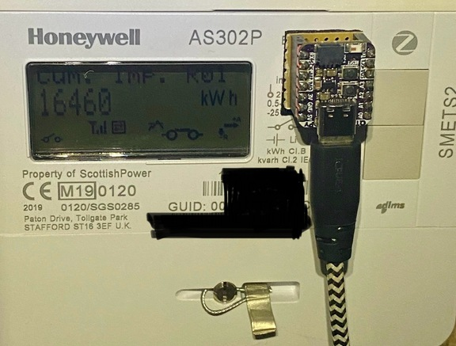
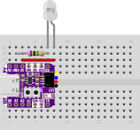

# LED Reader using OpenTelemetry
This is an Arduino example of counting the blinks of an LED and then passing on the counter value using [OTLP](https://opentelemetry.io/docs/specs/otel/protocol/).

## Hardware
It is a very simple design. This implementation is:
- An ESP32 as the WiFi-enabled microcontroller ([Adafruit QT Py ESP32-S2](https://learn.adafruit.com/adafruit-qt-py-esp32-s2))
- Phototransistor to read the LED (e.g. a [Vishay BPW85C](https://www.vishay.com/docs/81531/bpw85a.pdf))
- A pull-down resistor (e.g. 6.81MOhm)

## Software
The only external library used is [NanoPB](https://jpa.kapsi.fi/nanopb/) which uses very little memory for OTLP operations.
